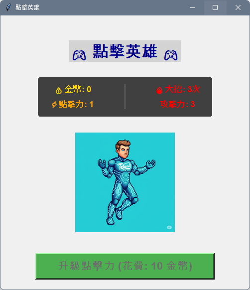

# 🎮 點擊英雄 (Click Hero)

一個有趣的點擊類遊戲，使用 Python Tkinter 開發的桌面應用程式。



## 📖 遊戲介紹

《點擊英雄》是一個簡單而有趣的點擊遊戲，玩家通過點擊英雄角色來獲得金幣，並使用金幣升級點擊力，讓每次點擊都能獲得更多收益。

## ✨ 遊戲特色

### 🎯 核心玩法
- **左鍵點擊**：獲得與點擊力相等的金幣
- **右鍵大招**：使用特殊攻擊，獲得點擊力3倍的金幣（每局遊戲限用3次）
- **升級系統**：使用金幣升級點擊力，提升每次點擊的收益

### 🎨 視覺設計
- 現代化的圓角UI設計
- 深灰色統計資訊區塊
- 3D效果的升級按鈕
- 即時動畫效果（點擊時圖片切換）

### 📊 遊戲系統
- **金幣系統**：累積金幣用於升級
- **點擊力系統**：影響每次點擊的收益
- **大招系統**：特殊攻擊，攻擊力為點擊力的3倍
- **升級系統**：動態價格，每次升級後費用隨機增加10-30金幣

## 🚀 安裝與執行

### 系統需求
- Python 3.7 或更高版本
- PIL (Pillow) 圖像處理庫

### 安裝步驟

1. **克隆專案**
   ```bash
   git clone [專案網址]
   cd vibe-coding-week3
   ```

2. **安裝依賴**
   ```bash
   pip install Pillow
   ```

3. **執行程式**
   ```bash
   python vibe-coding-2025.py
   ```

### 必要檔案
- `vibe-coding-2025.py` - 主程式檔案
- `hero.png` - 英雄角色圖片
- `hero_click.png` - 左鍵點擊效果圖片
- `hero_right_click.png` - 右鍵大招效果圖片

## 🎮 遊戲操作

### 基本操作
- **左鍵點擊英雄**：獲得金幣（數量 = 當前點擊力）
- **右鍵點擊英雄**：使用大招（攻擊力 = 點擊力 × 3）
- **點擊升級按鈕**：升級點擊力（需要足夠金幣）

### 遊戲策略
1. **初期**：多點擊英雄累積金幣
2. **中期**：適時使用大招獲得大量金幣
3. **後期**：平衡升級和點擊，最大化收益

## 📈 遊戲進階

### 升級費用計算
- 初始費用：10 金幣
- 每次升級後：費用隨機增加 10-30 金幣
- 公式：新費用 = 舊費用 + random.randint(10, 30)

### 大招系統
- 每局遊戲限用 3 次
- 攻擊力 = 當前點擊力 × 3
- 使用後次數減少，攻擊力保持不變

## 🛠️ 技術架構

### 開發技術
- **GUI框架**：Tkinter
- **圖像處理**：PIL (Pillow)
- **程式語言**：Python 3

### 主要功能模組
- `center_window()` - 視窗置中功能
- `update_stats()` - 統計資訊更新
- `upgrade_click_power()` - 點擊力升級
- `on_click()` - 左鍵點擊處理
- `on_right_click()` - 右鍵大招處理

### 全域變數
- `coins` - 當前金幣數量
- `click_power` - 當前點擊力
- `upgrade_cost` - 升級費用
- `special_attacks_left` - 大招剩餘次數
- `special_attack_power` - 大招攻擊力

## 🎯 遊戲目標

- 最大化金幣收益
- 策略性使用大招
- 合理分配升級時機
- 挑戰更高的點擊力等級

## 🔧 自訂功能

### 可調整參數
- 初始點擊力：修改 `click_power = 1`
- 初始升級費用：修改 `upgrade_cost = 10`
- 大招次數：修改 `special_attacks_left = 3`
- 大招倍率：修改升級函數中的 `special_attack_power = click_power * 3`

### 擴展建議
- 添加更多升級選項
- 實現存檔功能
- 添加音效和背景音樂
- 增加成就系統

## 📝 版本資訊

- **版本**：1.0.0
- **開發者**：Vibe Coding Week 3
- **最後更新**：2025年

## 🤝 貢獻

歡迎提交 Issue 和 Pull Request 來改善遊戲！

## 📄 授權

本專案採用 MIT 授權條款。

---

**享受遊戲，點擊英雄！** 🎮✨ 